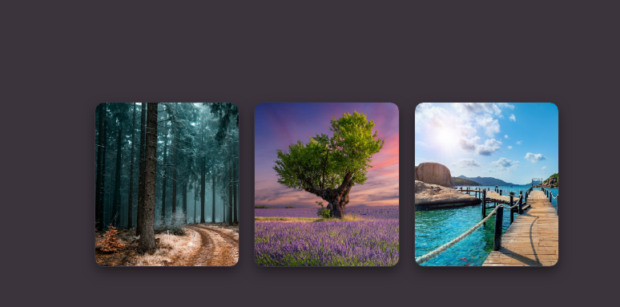

<div align="center">
  
 
  <br />
  <br />
  
  
  
  
  


  <h2 align="center">galery-card</h2>


  

</div>

<br />

### Demo Screeshots



### Prerequisites

Before you begin, ensure you have met the following requirements:

* [Git](https://git-scm.com/downloads "Download Git") must be installed on your operating system.

### Run Locally

To run **GALERY CARD** locally, run this command on your git bash:

Linux and macOS:

```bash
sudo git clone https://github.com/Maitomanito
```

Windows:

```bash
git clone https://github.com/Maitomanito
```

### Contact

If you want to contact with me you can reach me at [Twitter](https://www.twitter.com/donmaurom).

### License

This project is **free to use** and does not contains any license.
